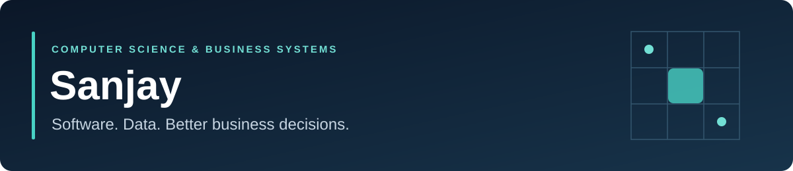

# Hi, I'm Sanjay

**Computer Science & Business Systems student · Enterprise applications · Applied AI & analytics**

I'm interested in how software and data can improve business decisions and everyday operations. My project work explores semantic text analysis, requirements engineering, and workflow design.

**Current direction:** build stronger systems through clear architecture, reproducible setup, and measurable evaluation.

## Selected projects

| Project | Business question | Technical focus | Current scope |
| --- | --- | --- | --- |
| [**NPN SCM — Team Vortex5**](https://github.com/NoumanS-20/NPN) | How can supply-chain teams choose suppliers and align demand, production, and financial plans? | Python, FastAPI, scikit-learn, LightGBM, PuLP, JavaScript | Cognizant NPN SCM Hackathon team project: **SupplyGuard** for supplier risk and procurement optimization; **TrendWear Planner** for demand forecasting and production planning |
| [**Aegis × ContextOS**](https://github.com/vvsanjay/aegis-contextoss) | How can teams spot changes between a project's original intent and its current documentation? | FastAPI, React/TypeScript, sentence-transformers, SQLAlchemy, Celery/Redis | Semantic drift prototype with supporting supply-chain scaffolding |
| [**BAIRBot**](https://github.com/vvsanjay/AI-chat-box) | How can teams draft, refine, and trace software requirements? | FastAPI, React, MongoDB, OpenAI API integration | Requirements-engineering prototype; integration work remains |
| [**Bandwise**](https://github.com/vvsanjay/AI-Powered-IELTS-preparation-ans-evaluation-platform-) | How could an IELTS practice service store submissions and track practice activity? | Flask, SQLAlchemy, JWT, SpeechRecognition | Backend scaffold; band scores are placeholders |

Each project README explains what is implemented, what still needs work, and where to find the relevant code.

## Technologies used in these repositories

| Area | Technologies |
| --- | --- |
| Programming | Python, JavaScript, TypeScript |
| Interfaces & APIs | React, FastAPI, Flask, REST |
| Data & analysis | SQLAlchemy, PostgreSQL configuration, MongoDB, pandas, NumPy |
| Applied AI | Sentence embeddings, cosine distance, LLM API integration |
| Engineering | Git, Docker Compose, Celery, Redis |

## Learning & collaborative work

- [**Data science notebooks**](https://github.com/vvsanjay/DATA-SCIRNCE-) — pandas transformations, missing-data inspection, NumPy reshaping, and Matplotlib.
- [**Calorie-based meal planner**](https://github.com/vvsanjay/AI-Dietician-Project) — a Python/Tkinter team project exploring priority queues and heuristic selection.
- [**DischargeFlow fork**](https://github.com/vvsanjay/DischargeFlow) — healthcare workflow code originally developed by [ftaakash](https://github.com/ftaakash). Original authorship is preserved; the fork README explains its scope.

## What I want to build next

Decision-support and enterprise workflow tools that connect a clear business problem with useful data, explainable results, and a usable interface.

**Explore:** [Repositories](https://github.com/vvsanjay?tab=repositories) · [Flagship project](https://github.com/vvsanjay/aegis-contextoss)
